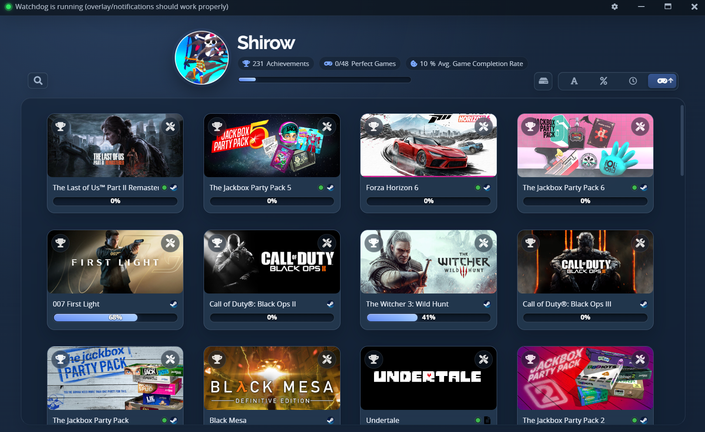
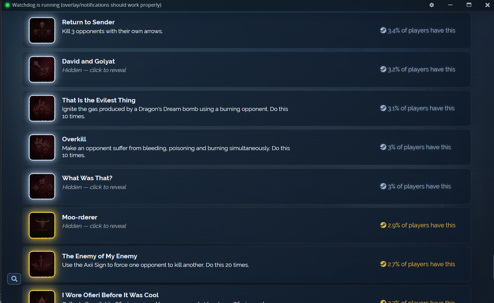
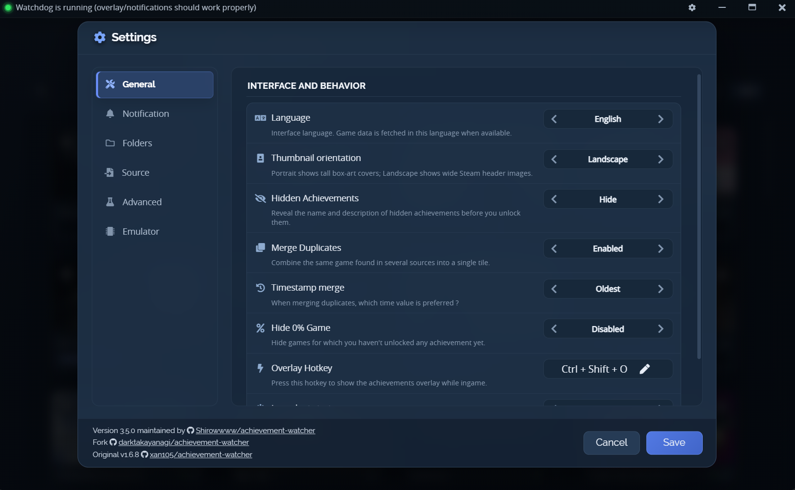
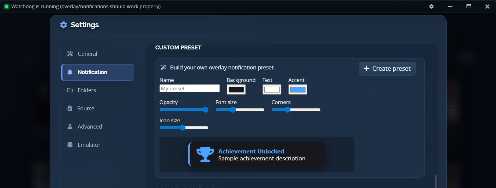
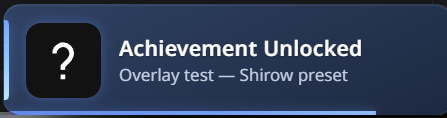

<div align="center">

# 🏆 Achievement Watcher 3.0

### A clean, modern achievement file parser for PC games — with real-time notifications.

Bring achievements from your PC games and supported emulators into **one modern Windows library**, with progress, rarity, playtime and a live notification the moment you unlock something.


<table>
<tr>
<td align="center"><br><sub>Unified game library</sub></td>
<td align="center"><br><sub>Per-game achievements & rarity</sub></td>
</tr>
</table>

</div>

> **Achievement Watcher 3.0** is an improved, modernized fork of [Xan105's original Achievement Watcher](https://github.com/xan105/Achievement-Watcher) (via [darktakayanagi](https://github.com/darktakayanagi/Achievement-Watcher)), distributed under **LGPL-3.0**.

---

## ✨ What's new in 3.0

Version 3.0 is a large stability, security, compatibility and feature pass on top of the base fork.

- 🔒 **Modern, hardened platform** — Electron 12 → 42 (Chromium 148, Node 24), every major dependency updated, XSS hardening, a tightened Content-Security-Policy, and **Windows 11 24H2+** compatibility (WMIC removed everywhere).
- 🧰 **System-tray app** — runs quietly in the tray; closing the window keeps tracking, playtime and notifications alive in the background. One lighter background process, one runtime.
- ⚡ **Faster & lighter** — bounded-concurrency loading, an optional browser-free data path with a Steam Web API key, a roughly halved emulator scan, a size-capped icon cache, and a ~80 MB smaller install.
- 🔔 **Reworked notifications** — Windows **toasts**, an in-game **overlay** (presets, sounds, custom preset builder), or **both**; "Rare · X%" labels, platinum toasts, per-game progress mute, and a duplicate guard.
- 🧩 **Goldberg / GBE tooling** — diagnose & repair `steam_settings`, install the maintained GBE Fork runtime, strip Steam DRM, and auto-fix new emulated games in the background ([details](#-goldberg--gbe-emulator-handling)).
- 🕵️ **Smarter detection** — an "installed games only" filter, rewritten per-game executable detection, and automatic new-game detection that registers fresh installs for playtime tracking.
- 🎮 **More sources** — ShadPS4 (PS4, live toasts), Xenia (Xbox 360), and EA Desktop, plus GreenLuma / Uplay / RPCS3 / Epic load fixes.
- 🎨 **Modern dark UI** — refreshed library, details, settings and dialogs; resizable window; advanced cover management; broader FR/EN localization.

<div align="center">
<br>
<sub>Real-time toast the moment an achievement unlocks</sub>
</div>

See [CHANGELOG.md](CHANGELOG.md) for the full notes and the [docs](docs/) for guides.

---

## 🎯 Supported sources

- ✅ Legitimate **Steam** libraries and common Steam emulator save formats (**Goldberg / GBE Fork**, **GreenLuma**, …)
- ✅ **GOG**, **Epic Games**, **Ubisoft Connect** and **EA Desktop**
- 🎮 **RPCS3** (PS3) trophies
- 🎮 **ShadPS4** (PS4) trophies — *including live unlock notifications*
- 🎮 **Xenia** (Xbox 360) achievements — *library display*

> A Steam Web API key is **optional** — it improves and speeds up Steam lookups, but the app falls back to automatic retrieval without one.

---

## 📥 Install & use

1. Download the latest `Achievement.Watcher.Setup.3.0.5.exe` from the [**Releases**](https://github.com/Shirowwww/Achievement-Watcher-3.0/releases) page.
2. Install and launch Achievement Watcher — it lives in the system tray; click the tray icon to open the library.
3. Open **Settings** to configure game folders, sources, notifications and the optional Steam Web API key.
4. Leave it running: the background tracker auto-starts at sign-in and keeps live notifications and playtime working even with the window closed.

> 💡 On first run, the setup guide auto-detects common save/achievement folders. If a game isn't detected, add its folder from **Settings → Folders → Generate configs**, or set its executable from the game's configuration dialog.

<div align="center">
<br>
<sub>Settings — interface, sources, notifications, folders and emulator tools</sub>
</div>

---

## 🔔 Notifications

Choose how unlocks are announced in **Settings → Notification**:

- **Toast** — native Windows notifications (with progress bar and game hero image for playtime).
- **Overlay** — a styled in-game popup drawn on top of the game, with a library of presets and sounds.
- **Both** — toast *and* overlay.

Extras: a no-code **custom preset builder** (colours, opacity, font/icon size, corners, live preview), **custom sounds** (import your own `.wav`/`.mp3`/`.ogg`), adjustable overlay **volume & duration**, movable/click-through overlays, "Rare · X%" labels for sub-10% unlocks, platinum toasts, and per-game progress-notification muting.

<table>
<tr>
<td align="center"><br><sub>Custom overlay preset builder</sub></td>
<td align="center"><br><sub>In-game overlay popup</sub></td>
</tr>
</table>

---

## 🧩 Goldberg / GBE emulator handling

Games that run through a Steam emulator (Goldberg, GBE Fork, and similar setups) store their achievements locally instead of on Steam. Achievement Watcher reads those saves, and can also **set up or repair the emulator runtime** for a game so its achievements are tracked correctly and pop up in-game.

**What it does** (right-click a game → *Emulator & tools*)

- **Diagnose** — a clear report of the game's emulator setup (which emulator, schema vs. save state, missing icons or descriptions, app-id mismatches).
- **Repair `steam_settings`** — rebuilds a correct achievement schema, icons, app id, DLC list and identity config, matching the names Steam actually uses.
- **Apply emulator fix (GBE Fork)** — installs the maintained [GBE Fork](https://github.com/Detanup01/gbe_fork) `steam_api(64).dll`, writes `steam_settings`, and creates the save folder so the game shows up immediately.
- **Remove Steam DRM (Steamless)** — strips Valve's SteamStub from a game's executable when a plain DLL swap won't load.
- **Back up / Restore configuration** — snapshot the emulator files before changes, and roll back a bad fix.

New emulated games can also be **fixed automatically in the background** (toggle in Settings → Emulator).

**When to use it** — when a cracked/emulated game's achievements aren't detected, descriptions are blank, or in-game pop-ups don't appear.

**What gets modified**

- The game's `steam_api.dll` / `steam_api64.dll` is replaced (original kept as `*.bak`).
- Files inside `steam_settings/` are written or refreshed (previous versions snapshotted under `steam_settings/.aw-backups/`).
- Optionally the game executable is unpacked by Steamless (original kept as `*.steamstub.bak`).

**Precautions**

- Use this only on games you own, for legitimate, personal achievement tracking.
- It modifies game files. Backups are made automatically, but use it at your own risk.
- It does **not** bypass online ownership checks, and it can't track PlayStation-PSPC Steam ports (e.g. *The Last of Us Part II*, *God of War*) — those trophies never reach the Steam API any emulator watches (use a RUNE release, which Achievement Watcher monitors out of the box).
- Antivirus tools sometimes flag emulator DLLs — see [Security & false positives](#-security--false-positives).

> Guides: [docs/emulator-setup.md](docs/emulator-setup.md) (user guide) · [GOLDBERG-GBE.md](GOLDBERG-GBE.md) (technical reference).

---

## 🛠️ Notable bugfixes & improvements

- Hidden achievement descriptions resolve correctly even with a Steam Web API key (`GetGameAchievements`), and stale blank entries are repaired in place.
- Persistent rarity (global unlock % and gold/silver/bronze tiers) cached per game — shown instantly and offline.
- No more permanent blacklisting after a single transient load failure; GreenLuma, Uplay, RPCS3 and Epic first-load failures fixed.
- Emulator notification edge cases (3DM, TENOKE, GOG/Nemirtingas, `[object Object]` titles) now notify correctly.
- Executable auto-detection rewritten so each game resolves to its own binary instead of several sharing one.
- Self-healing config — a corrupted folder database is quarantined and defaults restored instead of silently disabling your folders.
- Window resizable down to 900 × 600; the main window can no longer get stuck invisible at startup.

---

## 🔧 Build from source

Requirements: Windows and **Node.js ≥ 20.18** (Node 22+ recommended). Electron is downloaded automatically; native dependencies ship prebuilt — no Visual Studio / Python / node-gyp needed.

```powershell
cd watchdog
npm ci
cd ..\app
npm ci
npm run build
```

The NSIS installer is written to `app/dist/`. Full details (dev run, portable build, known gotchas, versioning) are in [BUILD.md](BUILD.md).

Run the automated checks from the repository root:

```powershell
node --test test\*.test.js
node --test watchdog\test\*.test.js
```

---

## 🔐 Security & false positives

Achievement Watcher is built from source with standard, **non-obfuscated** Electron + Node packaging.

- Some Electron apps — and the emulator-helper DLLs this tool can download on demand — are occasionally flagged as false positives by Windows Defender or other antivirus engines. This is a known industry issue with unsigned Electron builds and Steam-emulator binaries, not evidence of malware.
- **Download builds only from the [official Releases page](https://github.com/Shirowwww/Achievement-Watcher-3.0/releases).** Never install a build from a third-party mirror.
- Each release publishes the installer alongside its checksum; verify the SHA-256 of your download before installing.
- The installer is self-signed by electron-builder (not a trusted certificate). A proper code-signing certificate can be added in the future to reduce warnings.

If your antivirus quarantines a file, prefer reporting the false positive to your AV vendor over disabling protection.

---

## 🤝 Contributing & issues

Bug reports and feature requests are welcome via the [issue tracker](https://github.com/Shirowwww/Achievement-Watcher-3.0/issues) — please use the provided templates and include your OS, app version and relevant logs (`%AppData%\Achievement Watcher\logs`).

> The issue tracker is **not** a piracy helpdesk. Please keep reports focused on Achievement Watcher's behaviour.

---

## ⚖️ Credits & legal

Created originally by [Xan105](https://github.com/xan105/Achievement-Watcher), extended by [darktakayanagi](https://github.com/darktakayanagi/Achievement-Watcher) and the fork contributors. See [NOTICE.md](NOTICE.md) for full attribution.

This software does not provide copyrighted game content or bypass ownership checks. It is supplied **as-is** and is **not affiliated** with Valve, Sony, Microsoft, GOG, Epic Games or Ubisoft. All trademarks belong to their respective owners.
