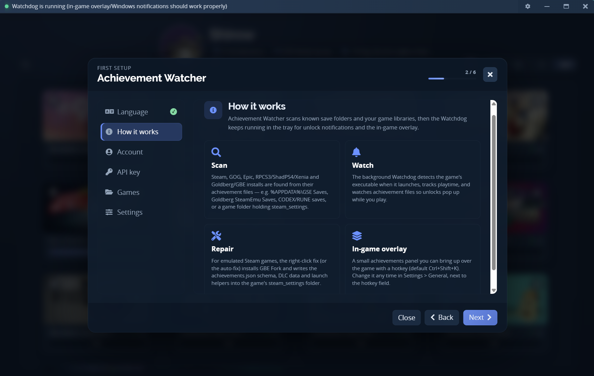
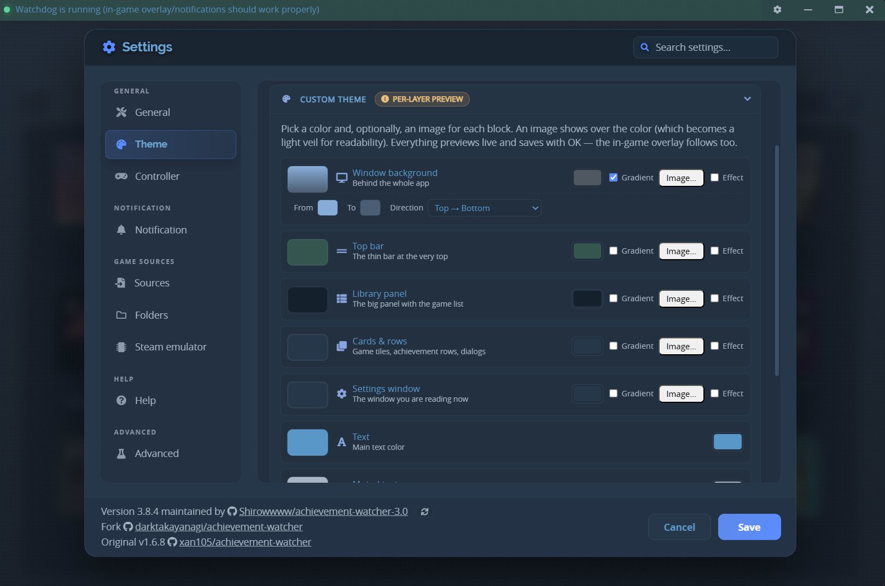
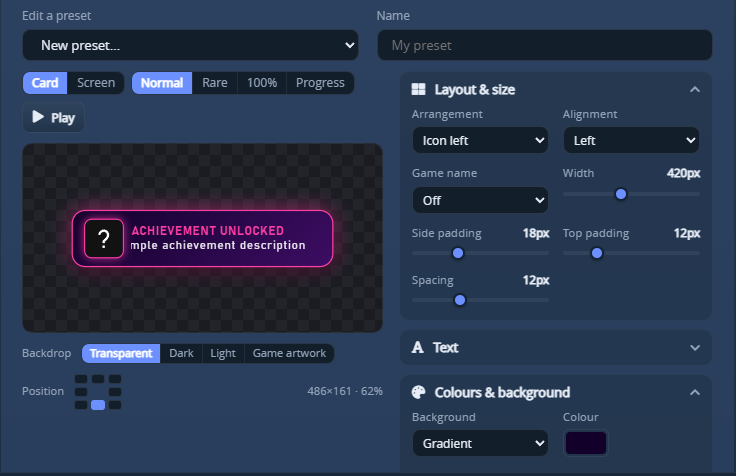
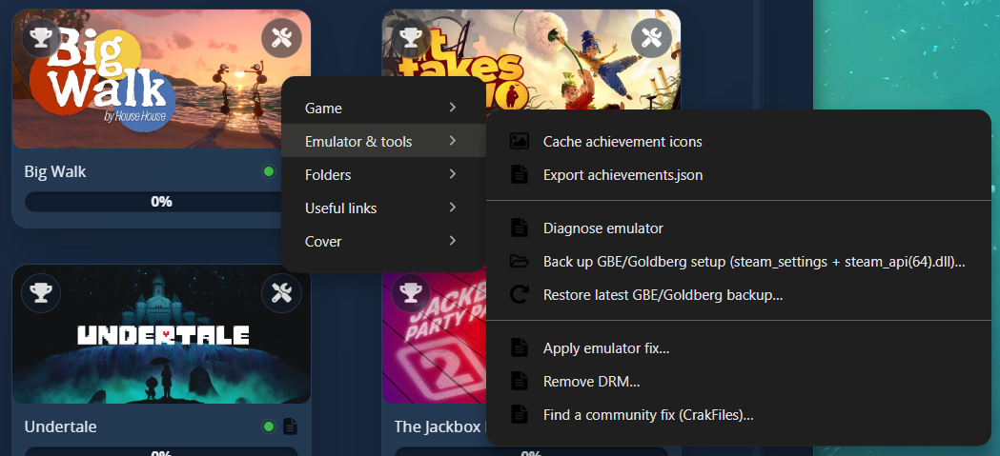

<div align="center">

# 🏆 Achievement Watcher Next

<p><strong>Every achievement. One experience.</strong></p>

Track achievements, rarity and playtime across launchers, local saves and supported emulators - with live Windows notifications or an in-game overlay.

[](https://github.com/Shirowwww/Achievement-Watcher-3.0/releases/latest)
[](https://github.com/Shirowwww/Achievement-Watcher-3.0/releases)


[](LICENSE)

**[Download](https://github.com/Shirowwww/Achievement-Watcher-3.0/releases/latest)** · [Documentation](docs/README.md) · [Changelog](CHANGELOG.md) · [Security](SECURITY.md) · [Issues](https://github.com/Shirowwww/Achievement-Watcher-3.0/issues)

<table>
<tr>
<td align="center"><br><sub>One library for every supported source</sub></td>
<td align="center"><br><sub>Progress, rarity and unlock history</sub></td>
</tr>
</table>

</div>

> **AW Next** is the modern next generation of Achievement Watcher.
>
> It continues [Xan105's original Achievement Watcher](https://github.com/xan105/Achievement-Watcher) and [darktakayanagi's 2.x branch](https://github.com/darktakayanagi/Achievement-Watcher), with a modern runtime and a large compatibility, reliability and feature pass.

---

## ✨ What AW Next adds

| Area | Main improvements over Achievement Watcher 2.x |
|---|---|
| **Modern foundation** | Electron 12 → 43, a current Node runtime, refreshed dependencies, tighter renderer security and Windows 10/11 support without WMIC |
| **More real sources** | Local Steam appcache, GOG Galaxy and Ubisoft Connect readers; optional Epic account connection; Xbox PC (Game Pass / Microsoft Store) account import; an EA achievement-log source for non-managed installs; Goldberg SocialClub; RPCS3, ShadPS4 and Xenia - each one individually switchable |
| **Goldberg / GBE / Uplay R2 tools** | Read-only diagnosis, `steam_settings` repair, matched GBE Fork runtime install, loader-version-aware Uplay R2 support, Steamless support, opt-in API-check bypass, backups/restore and opt-in background setup |
| **Better library** | Game and achievement search, installed-only filtering, blacklist restore, rarity tiers, progress achievements, persistent manual achievement unlocks, smarter covers with a per-game SteamDB/SteamGridDB gallery, automatic launch-executable detection, a shortcut to each entry's achievement-data folder and right-click uninstall |
| **Live tracking** | Tray-first background Watchdog, Xenia/ShadPS4/GOG/Ubisoft unlock monitoring, playtime and last-played dates for every tracked source (Steam, Ubisoft, Epic, GOG, EA, Xbox PC and standalone installs), safer startup baselines and duplicate suppression |
| **Notifications** | Native Windows notifications + a customizable, localized in-game overlay (stats bar, instant search, status filters, rarity badges, progress bars, density/icon-size/accent/zoom), preset library, custom builder, custom sounds, 0–200% volume, separate rare/completion styles and optional priority delivery that survives Do Not Disturb |
| **Controller and UI** | Full controller navigation of both the main app and the in-game overlay (XInput plus native PlayStation/Switch input), configurable button layout and bindings, mouse Back/Forward, resizable interface, collapsible settings sections that remember what you folded away, eighteen built-in themes (seven shown up front, the rest behind "More themes…") plus a Custom theme with per-layer colors/images/gradients, 18 bundled UI languages and a localized installer |
| **Local-first reliability** | Own data directory isolated from the original 1.6.8 app, migration-safe settings and avatar, offline names and artwork, local schemas, platform-aware cache IDs, bounded caches, self-healing folders, quiet update prompts and durable diagnostics |

---

## ⚖️ Quick comparison

| Feature | ⭐ **AW Next** | [Achievements](https://github.com/PSerban93/Achievements) | [Achievement Watcher 2.x](https://github.com/darktakayanagi/Achievement-Watcher) |
|---|:---:|:---:|:---:|
| Modern desktop runtime | ✅ Electron 43 | ✅ Electron 43 | ❌ Electron 12 |
| Unified dashboard, game and achievement search | ✅ Both | ✅ Both | ✅ Both |
| Installed-games-only filter and game actions | ✅ Filter · uninstall · restore | ❌ | ❌ |
| Automatic folder discovery/configuration | ✅ Auto-config & Smart Find | ✅ Auto-config | ✅ Smart Find |
| Official and local platform readers | ✅ Steam · GOG · Ubisoft · Epic · Xbox PC | ✅ Steam · GOG · Ubisoft · Epic · EA | ⚠️ Steam · GOG · Epic · Uplay (legacy) |
| Steam-emulator tracking | ✅ | ✅ | ✅ |
| Goldberg SocialClub (Rockstar/GTA) source | ✅ | ❌ | ❌ |
| Goldberg Uplay R2 support | ✅ Loader-version aware | ❌ | ❌ |
| GBE runtime install and schema repair | ✅ Full | ⚠️ Schema | ❌ Manual setup |
| Safe repair workflow | ✅ Backup/restore · Steamless · opt-in API-check bypass | ❌ | ❌ |
| Native Windows notifications and in-game overlay | ✅ Both | ✅ Both | ⚠️ Chromium / toast transports |
| No-code notification preset designer | ✅ | ❌ | ❌ |
| Separate rare and completion styles | ✅ | ✅ | ❌ Not documented |
| Live RPCS3 / ShadPS4 / Xenia unlocks | ✅ | ✅ | ⚠️ RPCS3 only |
| Full controller navigation | ✅ App + overlay | ✅ App + overlay | ❌ Planned only |
| Screenshot souvenirs | ✅ | ✅ | ✅ |
| Multiple UI themes | ✅ 18 + Custom | ✅ 8 | ❌ |
| Interface languages | ✅ 18 bundled | ✅ 30 locales | ✅ 18 locales |
| Xbox PC (Game Pass / Store) | ✅ Account import | ✅ Account import | ❌ |
| Manual achievement unlock | ✅ | ✅ | ❌ |
| Process trail for already-running games | ✅ | ✅ | ❌ |
| Random sound and FLAC/M4A/AAC support | ✅ | ✅ | ⚠️ Custom FLAC/M4A/AAC |
| Per-emulator notification presets | ✅ Xenia · RPCS3 · ShadPS4 | ✅ | ❌ |
| Emulator rarity and live Xbox unlocks | ✅ | ✅ | ❌ |

AW Next focuses on an all-in-one library, a quiet tray workflow, native Windows notifications and deeper Goldberg/GBE repair. **Achievements** has a strong auto-configuration and animated-overlay workflow. **Achievement Watcher 2.x** remains the historical base with broad emulator compatibility and several legacy notification transports.

<sub>✅ = supported and documented · ⚠️ = partial, manual or a different workflow · ❌ = unavailable or not documented on the current public branch. Compared against the public READMEs, package manifests and source on 13 August 2026.</sub>

---

## 🎯 Supported sources

| Source | Support |
|---|---|
| **Steam** | Local appcache state, public-profile data, schemas (including DLC/update achievement tags) and cached product metadata |
| **Steam-compatible saves** | Goldberg, GBE Fork, GreenLuma, SmartSteamEmu, TENOKE, RLD!, CreamAPI and compatible layouts |
| **GOG Galaxy** | Native local Galaxy databases and compatible legacy saves |
| **Epic Games** | Local installations and official achievement state after optional account connection |
| **Ubisoft Connect** | Native local data, legacy Uplay formats and compatible Uplay R2 setups, with Steam global percentages bridged onto native achievement ids |
| **EA Desktop log** | Achievement data recorded for non-launcher-managed installs; regular official EA-library installs are deliberately not listed |
| **Console emulators** | RPCS3, ShadPS4 and Xenia |
| **Xbox PC** | Local Game Pass / Microsoft Store installs plus imported Xbox Network achievement state (optional account connection) |

No Steam Web API key is used: schemas are fetched automatically (official Steam endpoint, then
SteamHunters/SteamCommunity fallbacks). Local sources and cached metadata work offline too.

---

## 📥 Install and use

1. Download `Achievement.Watcher.Setup.<version>.exe` from the [latest release](https://github.com/Shirowwww/Achievement-Watcher-3.0/releases/latest).
2. Install and open AW Next.
3. Use the first-run guide to choose your language, sources, folders and notification mode.
4. Run **Settings → Folders → Smart Find** and add any custom game or save location.
5. Leave the app in the system tray for live notifications and playtime tracking.

Everything else is covered by the in-app **Settings → Help** tab and the
[documentation](docs/README.md).

<table>
<tr>
<td align="center"><br><sub>Guided first-run setup</sub></td>
<td align="center"><br><sub>Sources, folders, notifications and diagnostics in one place</sub></td>
<td align="center"><br><sub>Per-layer colors, gradients, images and effects</sub></td>
</tr>
</table>

Settings, cache, playtime and achievement data live under `%APPDATA%\Achievement Watcher Next`. The first launch after upgrading imports an existing `%APPDATA%\Achievement Watcher 3.0` folder, and otherwise the original `%APPDATA%\Achievement Watcher` one - copied or hard-linked, never moved, so the folder you upgraded from stays intact and the 1.6.8 app and its uninstaller remain fully independent. Screenshot souvenirs follow the same rule, unless you picked your own folder, which is left exactly where it is. See [Getting started](docs/getting-started.md) for the full first-run and update guide.

---

## 🔔 Notifications

Leave it on **Automatic** and AW Next picks per unlock: the in-game overlay when it can be shown, a Windows notification when it cannot (exclusive fullscreen, no usable preset). **In-game overlay**, **Windows notification** and **Both** stay available under **Settings → Notification**.

- Presets for clean desktop, Steam, PlayStation, Xbox, rare and completion styles.
- A no-code preset builder with live preview: try a design as a real popup before saving it, reopen a saved preset to tweak it, and delete the ones you do not keep.
- Custom `.wav`, `.mp3`, `.ogg`, `.flac`, `.m4a` and `.aac` sounds.
- Position, scale, duration and overlay volume up to 200%.
- Separate presets for normal, rare and 100% completion events.
- Per-game progress mute without hiding real unlocks.
- Optional priority unlock notifications that can appear during Windows Do Not Disturb after your approval.
- Optional screenshot souvenirs.

<table>
<tr>
<td align="center"><br><sub>Delivery mode and per-context presets</sub></td>
<td align="center"><br><sub>No-code preset designer with a live preview of the real popup</sub></td>
<td align="center"><br><sub>In-game achievement overlay</sub></td>
</tr>
</table>

→ [Notification guide](docs/notifications.md)

---

## 🧩 Goldberg, GBE Fork and Uplay R2

Normal achievement reading is read-only. Extra actions appear under **Emulator & tools** when a local setup needs help:

- **Diagnose** the AppID, schema, save state, icons and configuration.
- **Repair `steam_settings`** while preserving richer existing data.
- **Apply GBE Fork** with the matching 32-bit or 64-bit runtime.
- **Back up and restore** DLLs and configuration files.
- **Use Steamless** after confirmation when SteamStub prevents a DLL replacement from loading.

<div align="center">
<br>
<sub>Right-click a game for diagnosis, repair and backup actions</sub>
</div>

Full background setup is **off by default**. Repairs create backups, but they still modify game files; use them only with games you own.

Ubisoft titles use a separate **Uplay R2** path because they do not load `steam_api.dll`. AW Next can derive a safe mapping for compatible games and reuse the normal `GSE Saves` pipeline. The loader must be provided locally because no stable official download exists.

Those games show the same Steam community percentage column as native Steam games: Uplay R2 uses its mapped Steam AppID directly, official Ubisoft Connect titles are bridged from Steam's global percentages onto their native ids, and the result is cached like any other rarity.

→ [Goldberg/GBE setup](docs/emulator-setup.md) · [Uplay R2 setup](docs/uplay-r2.md) · [Technical reference](docs/goldberg-gbe.md)

---

## 📚 Documentation

- [Getting started](docs/getting-started.md)
- [Notifications](docs/notifications.md)
- [Controller (gamepad)](docs/controller.md)
- [Troubleshooting](docs/troubleshooting.md)
- [Contributing](CONTRIBUTING.md)
- [Build guide](BUILD.md)
- [Architecture](docs/architecture.md)
- [Release workflow](docs/RELEASE_WORKFLOW.md)
- [Security policy](SECURITY.md)

The [documentation index](docs/README.md) explains what each guide covers.

## 🔧 Build from source

Requirements: Windows and Node.js `22.22.2+` or `24.15+`.

```powershell
Push-Location watchdog
npm ci
npm test
Pop-Location

Push-Location app
npm ci
npm test
npm run build
Pop-Location
```

The installer and updater files are written to `app\dist`. See [BUILD.md](BUILD.md) for packaging details and known constraints.

## 🔐 Security and support

Found a problem, have an idea, or simply want something improved? Please [open an issue](https://github.com/Shirowwww/Achievement-Watcher-3.0/issues) - reports and suggestions are what help AW Next become better. For a vulnerability, use the private process in the [security policy](SECURITY.md), not a public issue.

- Download builds only from the [official Releases page](https://github.com/Shirowwww/Achievement-Watcher-3.0/releases).
- Official installers use the project's self-signed `CN=Shirow` certificate. Users do not need to
  install or trust that certificate: the updater accepts the exact publisher identity on a fresh
  PC and still verifies the SHA-512 release manifest. SmartScreen or antivirus warnings remain
  possible because the certificate is not issued by a publicly trusted authority.
- `latest.yml` contains the installer's SHA-512 digest.
- Sensitive settings and Epic account tokens are encrypted before local storage.
- The project contains no game files and does not bypass online ownership checks.

For a bug report, include the app version, Windows version, affected source and relevant files from `%APPDATA%\Achievement Watcher Next\logs`. The issue tracker cannot provide games, credentials or piracy support.

## ⚖️ Credits and license

Created by [Xan105](https://github.com/xan105/Achievement-Watcher), continued by [darktakayanagi](https://github.com/darktakayanagi/Achievement-Watcher), and maintained here by Shirowwww and project contributors. Redistributions of this fork must retain the project attribution in [NOTICE](NOTICE).

Licensed under [LGPL-3.0](LICENSE), with the permitted attribution notice in [NOTICE](NOTICE). This project is not affiliated with Valve, Sony, Microsoft, GOG, Epic Games, Electronic Arts or Ubisoft.
