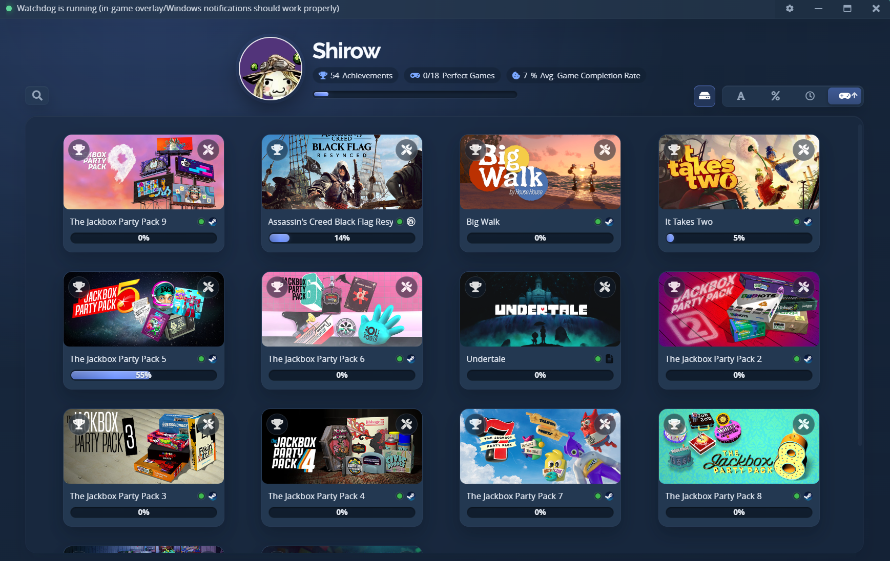
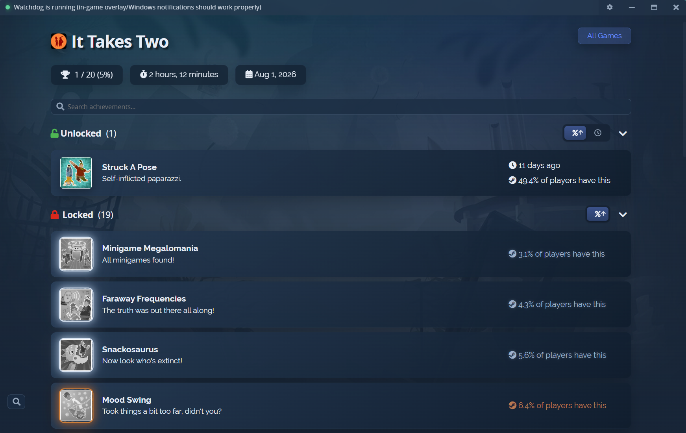
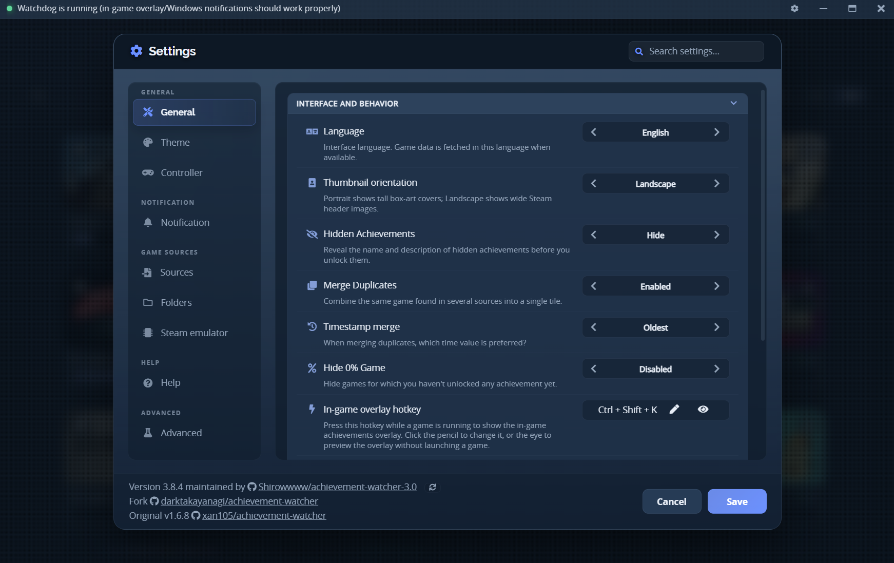
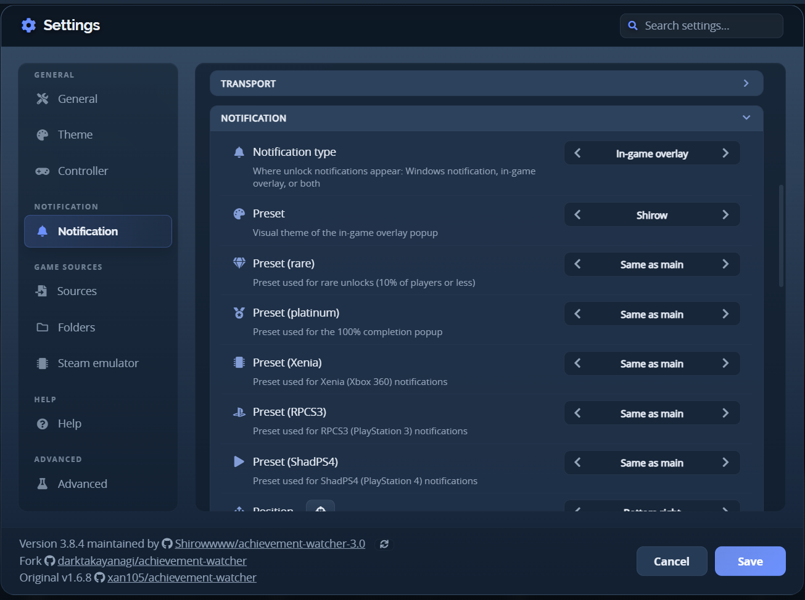
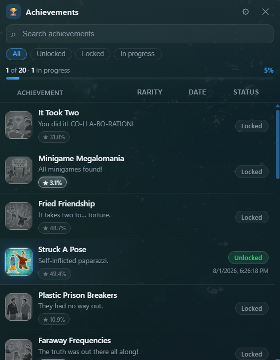

<div align="center">

# 🏆 Achievement Watcher 3.0

### All your PC achievements in one modern Windows library.

Track achievements, rarity and playtime across launchers, local saves and supported emulators — with live Windows notifications or an in-game overlay.

[](https://github.com/Shirowwww/Achievement-Watcher-3.0/releases/latest)
[](https://github.com/Shirowwww/Achievement-Watcher-3.0/releases)


[](LICENSE)

**[Download](https://github.com/Shirowwww/Achievement-Watcher-3.0/releases/latest)** · [Documentation](docs/README.md) · [Changelog](CHANGELOG.md) · [Issues](https://github.com/Shirowwww/Achievement-Watcher-3.0/issues)

<table>
<tr>
<td align="center"><br><sub>One library for every supported source</sub></td>
<td align="center"><br><sub>Progress, rarity and unlock history</sub></td>
</tr>
</table>

</div>

> This fork continues [Xan105's original Achievement Watcher](https://github.com/xan105/Achievement-Watcher) and [darktakayanagi's 2.x branch](https://github.com/darktakayanagi/Achievement-Watcher), with a modern runtime and a large compatibility, reliability and feature pass.

---

## ✨ What this fork adds

| Area | Main improvements since Achievement Watcher 2.x |
|---|---|
| **Modern foundation** | Electron 12 → 43, current Node runtime, refreshed dependencies, tighter renderer security and Windows 11 support without WMIC |
| **More real sources** | Local Steam appcache, GOG Galaxy and Ubisoft Connect readers; Epic account connection; EA Desktop; Xbox PC (Game Pass / Microsoft Store) with account import; Goldberg SocialClub; RPCS3, ShadPS4 and Xenia |
| **Goldberg / GBE / Uplay R2 tools** | Read-only diagnosis, `steam_settings` repair, matched GBE Fork runtime install, loader-version-aware Uplay R2 support, Steamless support, opt-in API-check bypass, backups/restore and opt-in background setup |
| **Better library** | Game and achievement search, installed-only filtering, blacklist restore, rarity tiers, progress achievements, smarter covers with a per-game SteamDB/SteamGridDB cover gallery, executable detection and right-click uninstall |
| **Live tracking** | Tray-first background Watchdog, Xenia/ShadPS4/GOG/Ubisoft unlock monitoring, safer startup baselines and duplicate suppression |
| **Notifications** | Native Windows notifications + a customizable, localized in-game overlay (stats bar, instant search, status filters, rarity badges, progress bars, density/icon-size/accent/zoom), preset library, custom builder, custom sounds, 0–200% volume and separate rare/completion styles |
| **Controller and UI** | Full controller navigation (XInput plus native PlayStation/Switch input), controller control of the in-game overlay, mouse Back/Forward, resizable interface, seven built-in themes plus a Custom theme with per-layer colors/images/gradients, 18 complete UI languages and a localized installer |
| **Local-first reliability** | Own data directory isolated from the original 1.6.8 app, a migration-safe avatar and installed-only filter, offline names and artwork, local schemas, platform-aware cache IDs, bounded caches, self-healing folders and fewer browser-dependent lookups |

---

## ⚖️ Quick comparison

| Feature | ⭐ **This fork** | [Achievements](https://github.com/PSerban93/Achievements) | [Achievement Watcher 2.x](https://github.com/darktakayanagi/Achievement-Watcher) |
|---|:---:|:---:|:---:|
| Modern desktop runtime | ✅ Electron 43 | ✅ Electron 43 | ❌ Electron 12 |
| Unified game dashboard | ✅ | ✅ | ✅ |
| Game + achievement search | ✅ Both | ✅ Both | ✅ Both |
| Installed-games-only filter | ✅ | ❌ | ❌ |
| Right-click game uninstall | ✅ | ❌ | ❌ |
| Automatic folder discovery/config | ✅ | ✅ Auto-config | ✅ Smart Find |
| Official/local platform readers | ✅ Steam · GOG · Ubisoft · Epic · EA | ✅ Steam · GOG · Ubisoft · Epic · EA | ⚠️ Steam · GOG · Epic · Uplay (legacy) |
| Steam-emulator tracking | ✅ | ✅ | ✅ |
| Goldberg SocialClub (Rockstar/GTA) source | ✅ | ❌ | ❌ |
| Goldberg Uplay R2 emulator support | ✅ Loader-version aware | ❌ | ❌ |
| GBE runtime install + schema repair | ✅ Full | ⚠️ Auto-config/schema | ❌ Manual setup |
| Backup and one-click restore | ✅ | ❌ | ❌ |
| Integrated Steamless path | ✅ | ❌ | ❌ |
| Opt-in Steam API ownership-check bypass | ✅ | ❌ | ❌ |
| Native Windows notifications | ✅ | ✅ Native preset | ✅ |
| Animated in-game overlay | ✅ | ✅ | ✅ Chromium |
| Windows notification + in-game overlay | ✅ | ❌ | ✅ |
| No-code custom preset builder | ✅ | ❌ | ❌ |
| Separate rare/completion presets | ✅ | ✅ | ❌ Not documented |
| Live RPCS3 / ShadPS4 / Xenia unlocks | ✅ | ✅ | ⚠️ RPCS3 only |
| Full controller UI navigation | ✅ | ✅ Full UI + overlay | ❌ Planned only |
| Screenshot souvenirs | ✅ | ✅ | ✅ |
| Multiple UI themes | ✅ 7 + Custom + user | ✅ 8 + user | ❌ |
| Interface languages | ✅ 18 complete | ✅ 30 locales | ✅ 18 locales |
| Xbox PC (Game Pass / Store) | ✅ Account import | ✅ Account import | ❌ |
| Manual achievement unlock | ✅ | ✅ | ❌ |
| User themes from AppData | ✅ | ✅ | ❌ |
| Process trail (playtime for already-running games) | ✅ | ✅ | ❌ |
| Random notification sound + FLAC/M4A/AAC | ✅ | ✅ | ⚠️ Custom FLAC/M4A/AAC |
| Per-emulator notification presets (Xenia/RPCS3/ShadPS4) | ✅ | ✅ | ❌ |
| Emulator rarity (Exophase global %) | ✅ | ✅ | ❌ |
| Live Xbox unlock notifications | ✅ | ✅ | ❌ |

This fork focuses on an all-in-one library, a quiet tray workflow, native Windows notifications and deeper Goldberg/GBE repair. **Achievements** has a strong auto-configuration and animated-overlay workflow. **Achievement Watcher 2.x** remains the historical base with broad emulator compatibility and several legacy notification transports.

<sub>✅ = supported and documented · ⚠️ = partial, manual or a different workflow · ❌ = unavailable or not documented on the current public branch. Checked against the public READMEs, package manifests and source (main.js/preload.js/index.html/utils) on 5 August 2026.</sub>

---

## 🎯 Supported sources

| Source | Support |
|---|---|
| **Steam** | Local appcache state, public-profile data, schemas and cached product metadata |
| **Steam-compatible saves** | Goldberg, GBE Fork, GreenLuma, SmartSteamEmu, TENOKE and compatible layouts |
| **GOG Galaxy** | Native local Galaxy databases and compatible legacy saves |
| **Epic Games** | Local installations and official achievement state after optional account connection |
| **Ubisoft Connect** | Native local data, legacy Uplay formats and compatible Uplay R2 setups, with Steam global percentages bridged onto native achievement ids |
| **EA Desktop** | Achievement data recorded by the EA client log |
| **Console emulators** | RPCS3, ShadPS4 and Xenia |
| **Xbox PC** | Local Game Pass / Microsoft Store installs plus imported Xbox Network achievement state (optional account connection) |

The optional Steam Web API key can improve some lookups, but local sources and cached metadata continue to work without one.

---

## 📥 Install and use

1. Download `Achievement.Watcher.Setup.<version>.exe` from the [latest release](https://github.com/Shirowwww/Achievement-Watcher-3.0/releases/latest).
2. Install and open Achievement Watcher.
3. Use the first-run guide to choose your language, sources, folders and notification mode.
4. Run **Settings → Folders → Smart Find** and add any custom game or save location.
5. Leave the app in the system tray for live notifications and playtime tracking.

<div align="center">
<br>
<sub>Sources, folders, notifications, appearance and diagnostics in one place</sub>
</div>

Updating over an older build keeps settings, cache, playtime and achievement data under `%APPDATA%\Achievement Watcher 3.0`. The first launch after upgrading imports the legacy `%APPDATA%\Achievement Watcher` folder once (copied, never moved), so the original 1.6.8 app and its uninstaller stay fully independent. See [Getting started](docs/getting-started.md) for the full first-run and update guide.

---

## 🔔 Notifications

Choose **Windows notification**, **In-game overlay** or **Both** under **Settings → Notification**.

- Presets for clean desktop, Steam, PlayStation, Xbox, rare and completion styles.
- A no-code preset builder with live preview.
- Custom `.wav`, `.mp3` and `.ogg` sounds.
- Position, scale, duration and overlay volume up to 200%.
- Separate presets for normal, rare and 100% completion events.
- Per-game progress mute without hiding real unlocks.
- Optional priority unlock notifications that can appear during Windows Do Not Disturb after your approval.
- Optional screenshot souvenirs.

<table>
<tr>
<td align="center"><br><sub>Preset library and custom builder</sub></td>
<td align="center"><br><sub>In-game achievement overlay</sub></td>
</tr>
</table>

[Notification guide](docs/notifications.md)

---

## 🧩 Goldberg, GBE Fork and Uplay R2

Normal achievement reading is read-only. Extra actions appear under **Emulator & tools** when a local setup needs help:

- **Diagnose** the AppID, schema, save state, icons and configuration.
- **Repair `steam_settings`** while preserving richer existing data.
- **Apply GBE Fork** with the matching 32-bit or 64-bit runtime.
- **Back up and restore** DLLs and configuration files.
- **Use Steamless** after confirmation when SteamStub prevents a DLL replacement from loading.

Full background setup is **off by default**. Repairs create backups, but they still modify game files; use them only with games you own.

Ubisoft titles use a separate **Uplay R2** path because they do not load `steam_api.dll`. Achievement Watcher can derive a safe mapping for compatible games and reuse the normal `GSE Saves` pipeline. The loader must be provided locally because no stable official download exists.

Those games show the same Steam community percentage column as native Steam games: Uplay R2 uses its mapped Steam AppID directly, official Ubisoft Connect titles are bridged from Steam's global percentages onto their native ids, and the result is cached like any other rarity.

[Goldberg/GBE setup](docs/emulator-setup.md) · [Uplay R2 setup](docs/uplay-r2.md) · [Technical reference](docs/goldberg-gbe.md)

---

## 📚 Documentation

- [Getting started](docs/getting-started.md)
- [Notifications](docs/notifications.md)
- [Troubleshooting](docs/troubleshooting.md)
- [Contributing](CONTRIBUTING.md)
- [Build guide](BUILD.md)
- [Architecture](docs/architecture.md)
- [Release workflow](docs/RELEASE_WORKFLOW.md)

The [documentation index](docs/README.md) explains what each guide covers.

## 🔧 Build from source

Requirements: Windows and Node.js `22.22.2+` or `24.15+`.

```powershell
Push-Location watchdog
npm ci
npm test
Pop-Location

Push-Location app
npm ci
npm test
npm run build
Pop-Location
```

The installer and updater files are written to `app\dist`. See [BUILD.md](BUILD.md) for packaging details and known constraints.

## 🔐 Security and support

- Download builds only from the [official Releases page](https://github.com/Shirowwww/Achievement-Watcher-3.0/releases).
- Releases are currently unsigned, so SmartScreen or antivirus warnings are possible.
- `latest.yml` contains the installer's SHA-512 digest.
- Sensitive settings and Epic account tokens are encrypted before local storage.
- The project contains no game files and does not bypass online ownership checks.

For a bug report, include the app version, Windows version, affected source and relevant files from `%APPDATA%\Achievement Watcher 3.0\logs`. The issue tracker cannot provide games, credentials or piracy support.

## ⚖️ Credits and license

Created by [Xan105](https://github.com/xan105/Achievement-Watcher), continued by [darktakayanagi](https://github.com/darktakayanagi/Achievement-Watcher), and maintained here by Shirowwww and project contributors.

Licensed under [LGPL-3.0](LICENSE). This project is not affiliated with Valve, Sony, Microsoft, GOG, Epic Games, Electronic Arts or Ubisoft.
