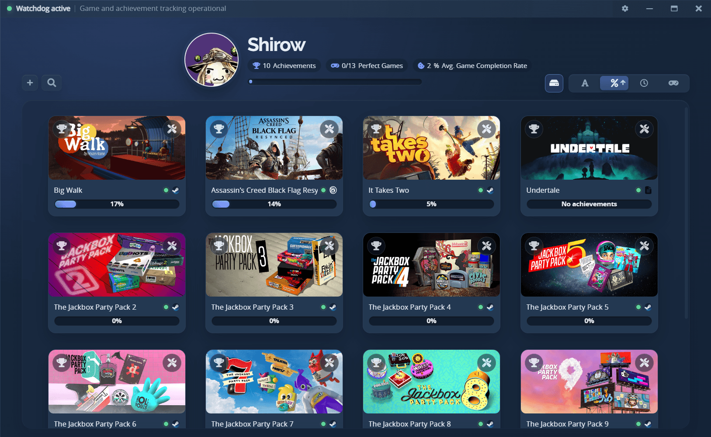
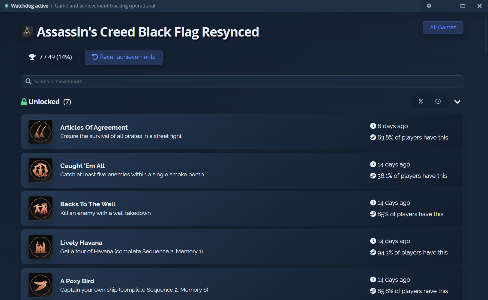
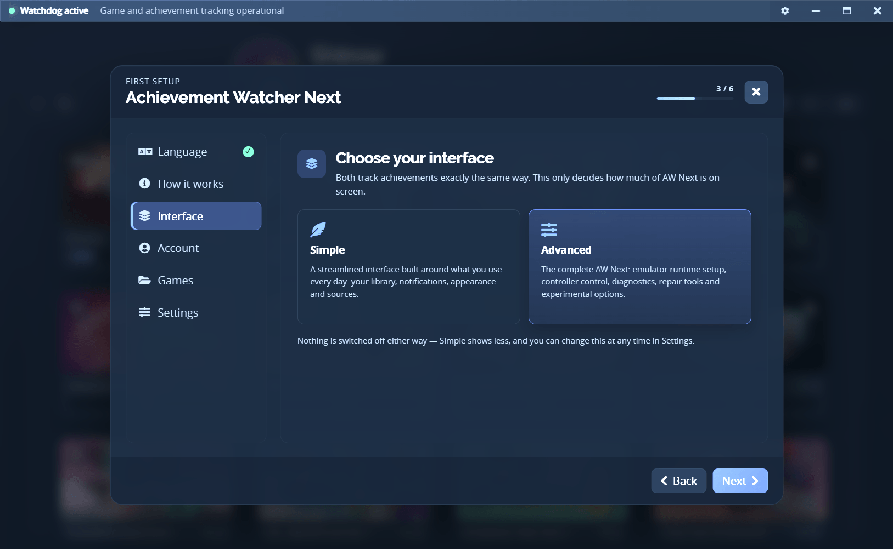
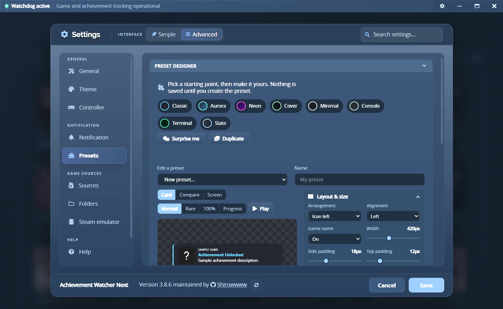
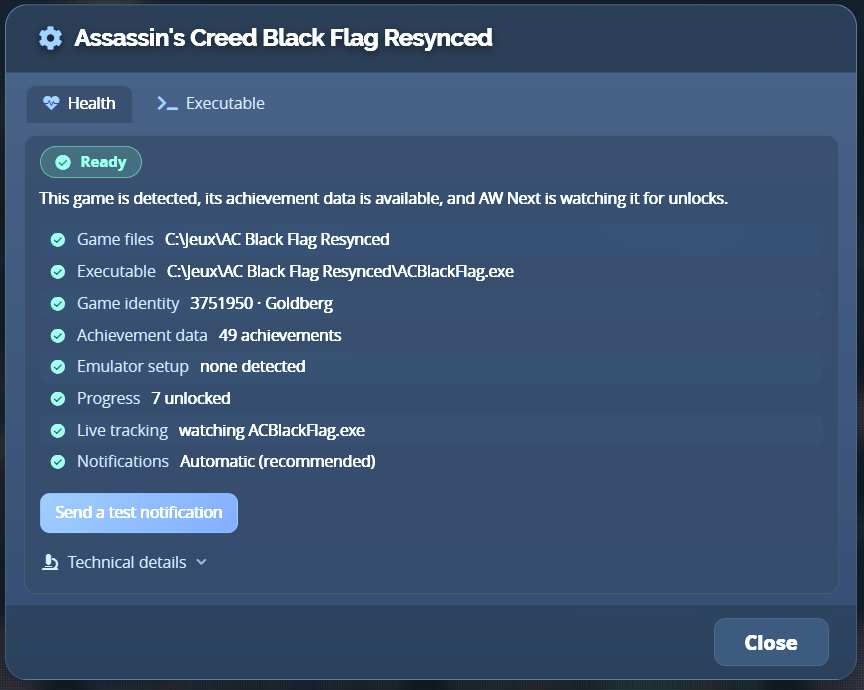

# 🏆 Achievement Watcher Next

<strong>Every achievement. One experience.</strong>

Track achievements, rarity and playtime across launchers, local saves and supported emulators - with
live Windows notifications or an in-game overlay.

**[Download](https://github.com/Shirowwww/Achievement-Watcher-3.0/releases/latest)** · [Documentation](docs/README.md) · [Changelog](CHANGELOG.md) · [Security](SECURITY.md) · [Issues](https://github.com/Shirowwww/Achievement-Watcher-3.0/issues)

<table>
<tr>
<td align="center"> One library for every supported source</td>
<td align="center"> Progress, rarity and unlock history</td>
</tr>
</table>

> **AW Next** is the next generation of Achievement Watcher.
>
> It continues [Xan105's original Achievement Watcher](https://github.com/xan105/Achievement-Watcher)
> and [darktakayanagi's 2.x branch](https://github.com/darktakayanagi/Achievement-Watcher), with a
> modern runtime and a large compatibility, reliability and feature pass.

---

## ✨ What it does

- **One library for every source.** Official launcher data, Steam-compatible saves and console
  emulators in a single list, with search, filters, rarity tiers, progress achievements and covers.
- **Notifications that choose their own transport.** Leave delivery on **Automatic** and each unlock
  arrives through the in-game overlay when it can be seen, and as a Windows notification when it
  cannot - never both.
- **A popup you can actually design.** Nine bundled presets, a no-code **Preset Designer** with a
  live preview of the real popup, and one-file `.awpreset` sharing.
- **An in-game overlay list.** The full achievement list of the running game on `Ctrl+Shift+K`, with
  search, filters and rarity badges - drivable entirely from a gamepad.
- **Answers when something is wrong.** Each game has a **Game Health** panel that says whether it is
  tracked, why not, and offers only the repairs that genuinely apply to it.
- **Repair tools for local setups.** Read-only diagnosis, `steam_settings` repair, matched GBE Fork
  runtime install, Uplay R2 support, backups and restore.
- **Yours to shape.** Simple and Advanced interface modes, built-in themes plus a custom one,
  full controller navigation, and 18 bundled interface languages.
- **Local-first.** No Steam Web API key, no required account, its own data directory, and caches that
  keep the library working offline.

<table>
<tr>
<td align="center"> Guided first-run setup</td>
<td align="center"> Design the popup, previewed live</td>
<td align="center"> Per-game health and guided repairs</td>
</tr>
</table>

→ [How AW Next compares to Achievement Watcher 2.x and Achievements](docs/comparison.md)

---

## 📥 Install

1. Download `Achievement.Watcher.Setup.<version>.exe` from the
   [latest release](https://github.com/Shirowwww/Achievement-Watcher-3.0/releases/latest).
2. Install and open AW Next.
3. Follow the first-run guide: language, interface, sources, folders and notifications.
4. Run **Settings → Folders → Smart Find**, and add any custom game or save location.
5. Leave the app in the system tray for live notifications and playtime tracking.

Settings, caches, playtime and achievement data live in `%APPDATA%\Achievement Watcher Next`.
Upgrading preserves them, and the first launch after an upgrade imports an older Achievement Watcher
folder without ever modifying it.

→ [Getting started](docs/getting-started.md) for the full first-run, discovery and update guide.

---

## 🎯 Supported sources

| Source | Support |
|---|---|
| **Steam** | Local appcache state, public-profile data, achievement lists (including DLC/update tags) and cached product metadata |
| **Steam-compatible saves** | Goldberg, GBE Fork, GreenLuma, SmartSteamEmu, CreamAPI, Nemirtingas and compatible layouts |
| **GOG Galaxy** | Native local Galaxy databases and compatible legacy saves |
| **Epic Games** | Local installations, and official achievement state after an optional account connection |
| **Ubisoft Connect** | Native local data, legacy Uplay formats and compatible Uplay R2 setups |
| **EA Desktop** | The local achievement log, for installs outside EA's managed folders |
| **Console emulators** | RPCS3, ShadPS4 and Xenia, each watched live |
| **Xbox PC** | Local Game Pass / Microsoft Store installs, plus imported Xbox Network state |

Each source is an individual switch, and no Steam Web API key is used: achievement lists are fetched
from public endpoints and cached locally.

→ [Compatible sources](docs/sources.md) for what each one needs · [Goldberg / GBE setup](docs/emulator-setup.md) · [Uplay R2 setup](docs/uplay-r2.md)

> [!WARNING]
> Reading achievements is read-only. The emulator repair tools do modify game files - always after a
> confirmation and always with a backup. Use them only with games you own.

---

## 📚 Documentation

Start at the **[documentation index](docs/README.md)**, which explains what each guide covers.

[Getting started](docs/getting-started.md) ·
[Sources](docs/sources.md) ·
[Notifications](docs/notifications.md) ·
[Presets](docs/presets.md) ·
[Overlay](docs/overlay.md) ·
[Controller](docs/controller.md) ·
[Game Health](docs/game-health.md) ·
[Troubleshooting](docs/troubleshooting.md) ·
[FAQ](docs/faq.md) ·
[Advanced tools](docs/advanced.md)

For contributors: [Contributing](CONTRIBUTING.md) · [Build guide](BUILD.md) ·
[Architecture](docs/architecture.md) · [Release workflow](docs/RELEASE_WORKFLOW.md)

## 🔧 Build from source

Requires Windows and Node.js `22.22.2+` or `24.15+`. The app and the background Watchdog are separate
npm workspaces; `npm run build` writes the installer and updater files to `app\dist`.

See [BUILD.md](BUILD.md) for the full setup, packaging details and known constraints.

## 🔐 Security and support

Found a problem, have an idea, or simply want something improved?
[Open an issue](https://github.com/Shirowwww/Achievement-Watcher-3.0/issues) - reports and
suggestions are what help AW Next get better. For a vulnerability, use the private process in the
[security policy](SECURITY.md) rather than a public issue.

- Download builds only from the
  [official releases page](https://github.com/Shirowwww/Achievement-Watcher-3.0/releases).
- Official installers use the project's self-signed `CN=Shirow` certificate. You do not need to
  install or trust that certificate: the updater accepts the exact publisher identity on a fresh PC
  and still verifies the SHA-512 release manifest. SmartScreen or antivirus warnings remain possible
  because the certificate is not issued by a publicly trusted authority.
- `latest.yml` carries the installer's SHA-512 digest.
- Sensitive settings and connected-account tokens are encrypted before local storage.
- The project contains no game files and does not bypass online ownership checks.

For a bug report, include the app version, Windows version, affected source and the relevant files
from `%APPDATA%\Achievement Watcher Next\logs`. The issue tracker cannot provide games, credentials
or piracy support.

## ⚖️ Credits and license

Created by [Xan105](https://github.com/xan105/Achievement-Watcher), continued by
[darktakayanagi](https://github.com/darktakayanagi/Achievement-Watcher), and maintained here by
Shirowwww and project contributors. Redistributions of this fork must retain the project attribution
in [NOTICE](NOTICE).

Licensed under [LGPL-3.0](LICENSE), with the permitted attribution notice in [NOTICE](NOTICE). This
project is not affiliated with Valve, Sony, Microsoft, GOG, Epic Games, Electronic Arts or Ubisoft.
